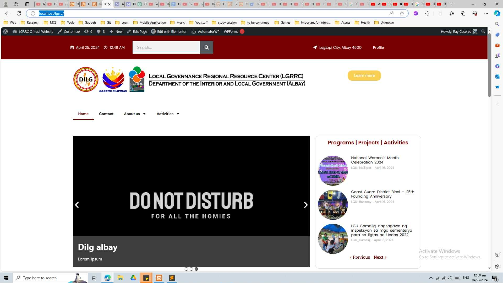
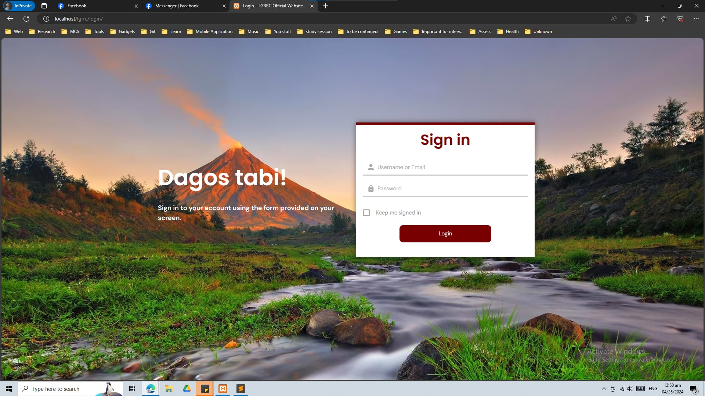
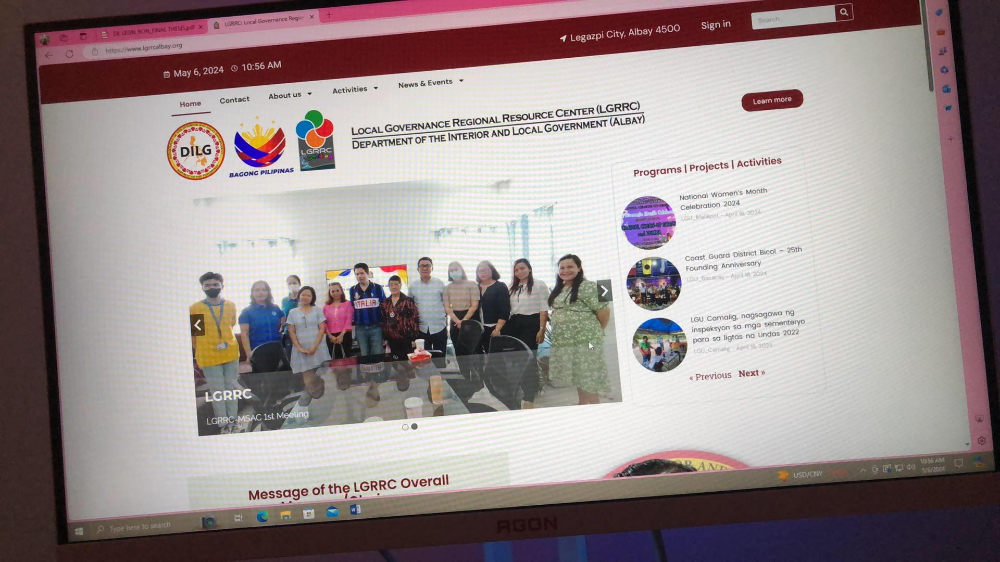
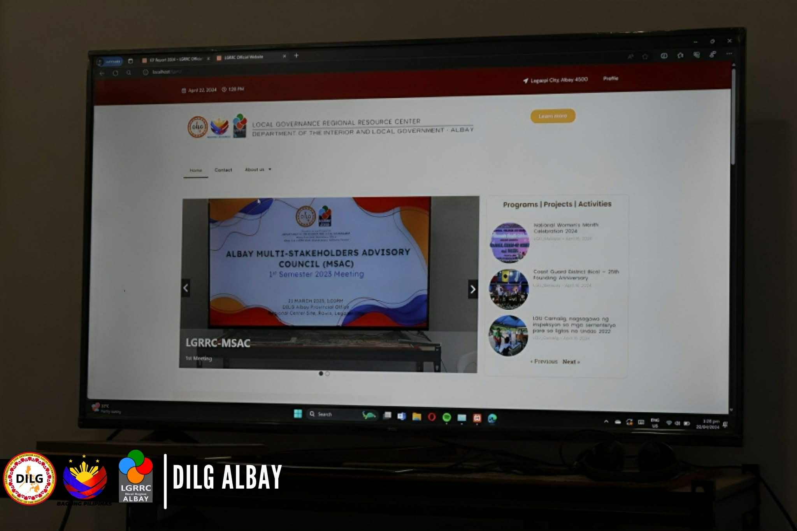

<div align="center">

  <h1>🏛️ LGRRC Albay - Official Digital Platform</h1>
  
  <p>
    The centralized <b>Local Governance Regional Resource Center (LGRRC)</b> portal <br />
    developed for the <b>Department of the Interior and Local Government (DILG) Albay</b>.
  </p>

  <p>
    
    
    
    
  </p>
  
  

</div>

<br />

## 📖 Overview

The **LGRRC Albay Official Website** serves as the primary knowledge hub for local government units in the Bicol region. It was designed to streamline information dissemination, promote transparency, and showcase the department's programs, projects, and activities (PPAs).

Built on **WordPress** using **Elementor Pro**, the platform features a custom-designed theme that reflects the region's identity, a secure login portal for administrators, and a dynamic content management system for real-time updates.

---

## 🚀 Key Features

| Feature | Description |
| :--- | :--- |
| **📰 Dynamic News & Events** | Automated sections for showcasing "Programs, Projects, and Activities" with date tracking. |
| **🌋 Custom Login Experience** | A branded "Dagos Tabi" (Welcome) sign-in page featuring the Mayon Volcano, replacing the default WordPress login. |
| **📚 Resource Repository** | dedicated sections for downloadable governance manuals, memos, and legal issuances. |
| **📱 Fully Responsive UI** | Optimized layout that adapts seamlessly from large presentation monitors to mobile devices. |
| **🛡️ Admin Dashboard** | A simplified backend for non-technical staff to post updates and manage media effortlessly. |

---

## 📸 Project Gallery

<table>
  <tr>
    <td width="50%">
      <h3 align="center">Custom Login Portal</h3>
      
    </td>
    <td width="50%">
      <h3 align="center">Live Deployment</h3>
      
    </td>
  </tr>
  <tr>
    <td colspan="2">
      <h3 align="center">Presentation Mode (Smart TV Display)</h3>
      
    </td>
  </tr>
</table>

---

## 🛠️ Technologies Used

* **CMS:** WordPress
* **Page Builder:** Elementor Pro
* **Database:** MySQL
* **Server:** Apache / NGINX (depending on hosting)
* **Language:** PHP, HTML5, CSS3

---

## 🔧 Installation & Setup

1.  **Clone the Repository** (if source code is available):
    ```bash
    git clone [https://github.com/yourusername/lgrrc-albay-v1.git](https://github.com/yourusername/lgrrc-albay-v1.git)
    ```
2.  **WordPress Import**:
    * Install a fresh WordPress instance.
    * Install **Elementor** and **Elementor Pro**.
    * Use the `All-in-One WP Migration` plugin (or similar) to import the `.wpress` file provided in the releases.
3.  **Database Configuration**:
    * Update `wp-config.php` with your local database credentials.
4.  **Permalinks**:
    * Go to *Settings > Permalinks* and click "Save Changes" to flush rewrite rules.

---

<div align="center">
  <p>Developed by <b>Lance Esureña</b></p>
  <p>
    <a href="https://www.linkedin.com/in/lance-madel-esure%C3%B1a-ba4871282/">
      
    </a>
    <a href="https://lance-portfolio.vercel.app/">
      
    </a>
  </p>
</div>
